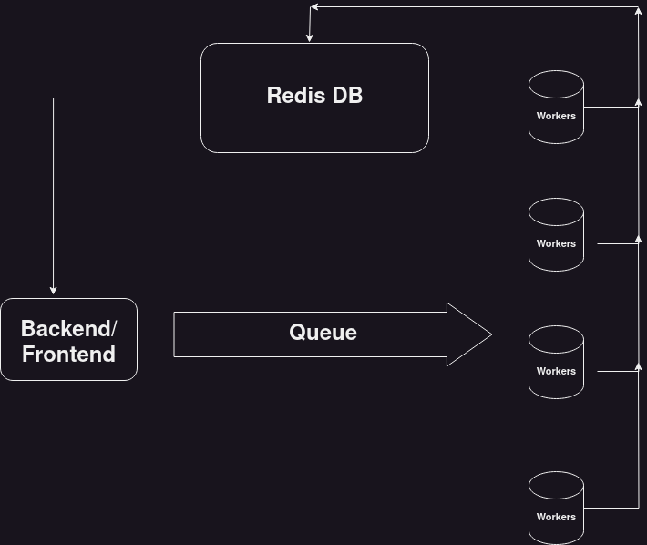

# Code Execution service

## Architecture


## Description

This implementation is very crude and done for the sake of learning.
C, C++, Java and python are supported
Requires to strictly follow queue schema which is

```json
{
    "lang": "java",
    "code": "import java.util.Scanner; public class Main {\n  public static void main(String[] args) {\n int a,b; Scanner sc = new Scanner(System.in); a = sc.nextInt(); b = sc.nextInt(); System.out.println(a+b); }\n}",
    "input": "1 2",
    "expected_output": "3",
    "problem_id": 1,
    "user_id": 1
}
```

A test Implementation can be found in `testProducer.py`

I have not integrated this with the main project i.e. server and client due to my inexperienced with js, although I believe it should be easy to do so.

## How to run
        
```bash
docker-compose up --build
```


